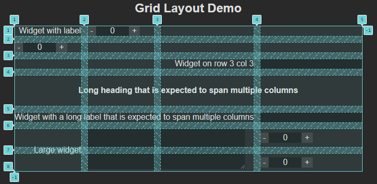

# Grid Layout

## Overview

Black Hawks Scouting's layout system is based on the CSS Grid layout model, allowing for powerful and complex widget positioning.

In the grid model, widgets can occupy different numbers of cells; they can also be located in different cells. These are controlled by the following fields in a widget's [object](config.md#widget-objects); they are all of type `number`:

- `row`, `col` (Positioning)
- `rowspan`, `colspan` (Sizing)
- `labelColspan` (Label sizing)

## Layout Properties

This is an example demonstrating positioning, sizing, and alignment. The grid visualization is shown in the image. Note the following:

- Widget labels are always in a separate cell directly to the left of their corresponding widgets.
- The thin strips filled with dashed lines are spacing between cells.
- Rows and columns stretch to accomodate their largest widget.
- Row and column numbers start from 1.



The JSON configuration file will be given at the end of this document.

## Positioning

A widget's *position* is the grid cell its *label* is in. The widget itself is always on the same row and one column to the right of its label.

In cases where a widget doesn't have a label (depending on its type or if `noLabel` is `true`), its position is the grid cell *it* is in.

By default, widgets are positioned in column 1, and one row under the previous widget. The first widget starts on row 1.

The `row` and `col` fields set the row and column number of a widget's position. If one is not specified, the default behavior above is used for it.

## Sizing

By default, widgets take up one row and one column. The same applies for widget labels.

The `rowspan` and `colspan` fields control how many rows and columns a widget takes up. The `rowspan` field also affects the widget's label (if it has one), but the `colspan` field doesn't.

The `labelColspan` field controls how many columns a widget's label takes up. This field is ignored if it is applied to a widget with no label.

## Full Demo Configuration

```json
{
  "skipTeamSelection": true,
  "pages": [
    {
      "name": "Grid Layout Demo",
      "widgets": [
        {
          "name": "Widget with label",
          "type": "spinbox"
        },
        {
          "name": "Widget without label",
          "type": "spinbox",
          "noLabel": true
        },
        {
          "name": "Widget on row 3 col 3",
          "type": "text",
          "row": 3,
          "col": 3
        },
        {
          "name": "Long heading that is expected to span multiple columns",
          "type": "heading",
          "colspan": 4,
          "align": "center"
        },
        {
          "name": "Widget with a long label that is expected to span multiple columns",
          "type": "text",
          "labelColspan": 3
        },
        {
          "name": "Large widget",
          "type": "textarea",
          "rowspan": 2,
          "colspan": 2
        },
        {
          "name": "Spinbox",
          "type": "spinbox",
          "noLabel": true,
          "row": 6,
          "col": 4
        },
        {
          "name": "Spinbox",
          "type": "spinbox",
          "noLabel": true,
          "row": 7,
          "col": 4
        }
      ]
    }
  ]
}
```
